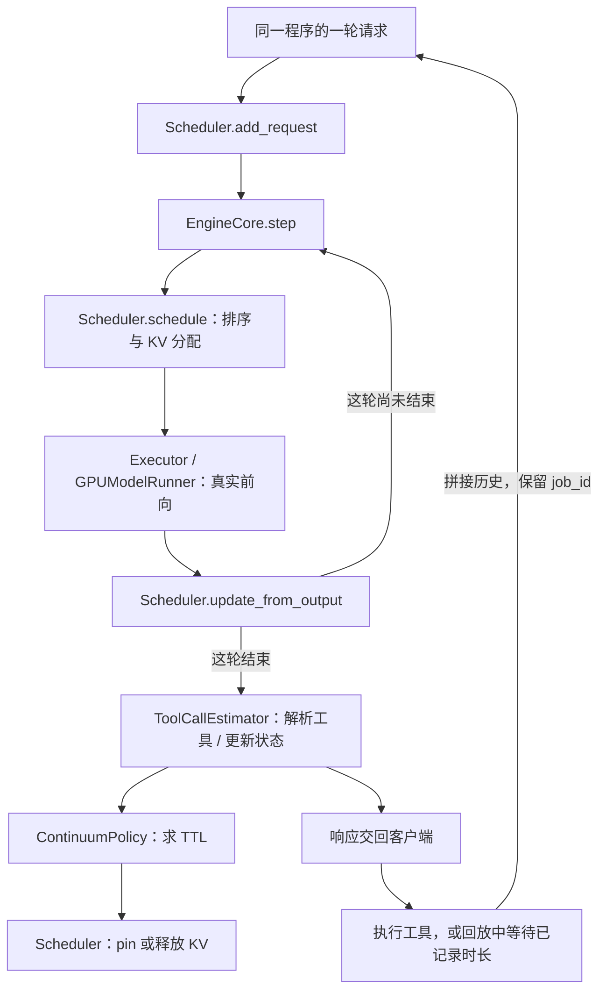

# 新版 Continuum：源码导读、调用链与小数据集

本文对应 H200-1 上直接修改的原仓库：

```text
/export/home/ext.luohaowen1/continuum/vllm-continuum
```

它是 vLLM 0.10.2 系列的推理引擎，加上在原 V1 Scheduler 内独立重建的 Continuum。不是重新写了一个模型，也不是调用旧 ElasticScheduler。论文未公开的估计器细节仍包含本项目明确记录的重建选择；实现完成、测试通过与复现论文性能是三件不同的事。

2026-09-21 更新：补充按 arXiv:2511.02230v6（2026-05-25）§4.2/4.3 核对的三级冷启动与被抢占请求优先规则。此前“未知工具默认 TTL=0”的说明已更正。完整证据见同目录的 `continuum-conformance-v6.zh.md`。

## 1. 先理解三个对象

- **程序 / job**：一个 agent 完整解决一道题的过程，例如一条 SWE trace。跨轮使用同一个 job_id。
- **请求 / request**：一次模型调用。一个程序可包含很多次请求，每轮有不同 request_id。
- **KV block**：vLLM 管理 attention KV 的分页单元。模型参数不是 KV；Continuum 主要改变 KV 保留和请求次序，不改变模型权重。

典型过程：模型请求 → 输出一个工具调用 → 外部执行工具 → 结果加入历史 → 同程序发下一轮模型请求。

普通请求结束不代表程序结束。Continuum 想在工具等待期暂时保护上一轮 KV，使下一轮更容易复用，并把这种跨轮连续性纳入调度。

## 2. 仓库整体结构

下列树以 `/export/home/ext.luohaowen1/continuum/vllm-continuum` 为根：

```text
vllm-continuum/
├── vllm/
│   ├── entrypoints/openai/       HTTP / OpenAI-compatible API 入口
│   ├── entrypoints/llm.py        离线 LLM 接口
│   ├── config/                  模型、调度、缓存等配置
│   ├── model_executor/          模型结构、attention 等算子层
│   └── v1/
│       ├── engine/              输入转换、进程通信、主执行循环
│       ├── request.py           一轮请求的状态对象
│       ├── core/
│       │   ├── continuum_policy.py     TTL 数学模型与历史
│       │   ├── estimate_with_func.py   工具解析、程序生命周期
│       │   ├── sched/scheduler.py      调度、pin/unpin、抢占
│       │   ├── sched/request_queue.py 程序级请求排序
│       │   ├── kv_cache_manager.py     KV 查找、分配、释放
│       │   └── block_pool.py           实际 block 引用和可回收队列
│       ├── executor/            把执行计划发给 worker
│       ├── worker/              模型在 GPU 上真正执行
│       └── sample/              采样、logits processor
├── csrc/                        C++ / CUDA 内核；此次没有重写
├── mini-swe-agent/               真正跑 agent/工具的客户端
├── tools/continuum/              源码启动、profile、数据检查、GPU 回放工具
├── tests/continuum/              新版策略/生命周期/缓存/数据工具测试
├── docs/                        原文档和本中文导读
├── benchmarks/                  vLLM 自带 benchmark，非全部都是 Continuum 实验
└── continuum_exp/               分析脚本及作者随仓库保存的参考结果
```

`continuum_exp` 中作者的 Llama70B 参考结果，不是本次 H200 新版本验证结果。DeepSeek 原始数据和本次生成的小集也不在这个子仓库内，位置见第 6 节。

## 3. 主要实现文件与推荐阅读顺序

| 顺序 | 文件 / 核心对象 | 看什么 |
|---|---|---|
| 1 | `continuum_policy.py` / ContinuumPolicy | 如何把历史转换为 TTL，为什么不能只看工具平均时长 |
| 2 | `estimate_with_func.py` / ToolCallEstimator | 何时学工具时间、何时认为程序完成、如何解析模型输出 |
| 3 | `request_queue.py` / ContinuumRequestQueue | 为什么同程序的返回请求不会每轮都从队尾开始 |
| 4 | `scheduler.py` / Scheduler | 谁实际持有 KV 引用，何时 pin、过期、回收、抢占 |
| 5 | `request.py` / Request | job_id、request_id、token 进度、deadline 各指什么 |
| 6 | `engine/core.py` / EngineCore.step | CPU 调度与 GPU 模型计算的连接点 |
| 7 | `kv_cache_manager.py` / KVCacheManager | APC 命中、KV 分配、free 与物理删除的区别 |

### 策略层：只回答保留多久

文件：`/export/home/ext.luohaowen1/continuum/vllm-continuum/vllm/v1/core/continuum_policy.py`

关键入口 `choose_ttl(tool, context_tokens)`：

```text
选择使下式最大的 tau：
工具在 tau 内返回的经验概率 × (重建成本 + eta × 被回收后的平均等待成本) − tau
```

经验分布阶段的候选 tau 是 0 和已观测工具时长。v6 §4.2 明确要求三级冷启动：全局历史不超过 100 次时，使用平均 1 秒的指数分布和 eta=1；全局超过 100、当前工具不超过 100 次时，使用全局经验分布；当前工具超过 100 次才使用单工具经验分布。不能再把未知工具一律设为 TTL=0。

经验 eta 来自已经完成的程序，不读取当前程序未来轮数。重建成本来自真实 profile，不是手填常数。将冷启动假设代入同一目标函数，令 B=平均等待+重建秒数，则 B>1 秒时 tau=log(B/1秒) 秒，否则为零；这不是固定两秒策略。

### 服务端适配层：把请求事件变成历史

文件：`/export/home/ext.luohaowen1/continuum/vllm-continuum/vllm/v1/core/estimate_with_func.py`

- `request_arrives`：若同程序上一轮在等工具，用这轮到达时间减上轮完成时间，得到观测等待。
- `request_finished`：正常响应才解析工具。还有工具则求 TTL；真正结束则记录程序长度。
- `mark_evicted` / `request_scheduled`：记录撤销保护/抢占之后的等待，训练排队代价。
- `set_up_pin`：只返回绝对 deadline 剩余时长，旧轮次的延迟回调不能重新获得完整 TTL。

这里**只识别**工具名，不运行 bash/JSON 指定的工具。工具在 agent 所在进程或任务容器中执行。

### 调度执行层：真正安排请求与 KV

文件：`/export/home/ext.luohaowen1/continuum/vllm-continuum/vllm/v1/core/sched/scheduler.py`

先看 `add_request`、`schedule`、`_free_request`、`_free_blocks`，再看 pin/unpin 和抢占的细节。`schedule` 每个 tick 清理到期保护、推进 running、接纳 waiting，并输出 SchedulerOutput。GPU 不在这个方法内执行。

新实现的显存不足路径会优先尝试按程序首次到达时间倒序整体 unpin；仍不足才抢占 running。这是当前实现的策略选择，不应与旧框架的回收触发顺序混为一谈。

### 排队与缓存不是同一个模块

文件：`/export/home/ext.luohaowen1/continuum/vllm-continuum/vllm/v1/core/sched/request_queue.py`

排序分组：被抢占的请求最优先 → 其余有 pin 的请求 → 其余未 pin 的请求；每组内再按程序首次到达时间排序，请求到达时间仅用于平局。此文件不计算 TTL，也不分配 GPU 内存。

文件：`/export/home/ext.luohaowen1/continuum/vllm-continuum/vllm/v1/core/kv_cache_manager.py`

`get_computed_blocks` 根据 token 前缀查命中；`allocate_slots` 取得块引用并分配缺口；`free` 释放某个 request 的引用。**free/unpin 不等于马上删除 KV**：未覆盖的可回收块还可能命中。

## 4. 两条入口，共用一条核心执行链

### 真正在线跑 agent

```text
mini-swe-agent 的 VllmModel.query
→ HTTP /v1/chat/completions
→ OpenAIServingChat / AsyncLLM / Processor
→ EngineCoreClient → EngineCore.add_request
→ Scheduler.add_request
```

### 固定 trace 回放

```text
tools.continuum.verify_gpu
→ LLMEngine.add_request / Processor
→ EngineCoreClient → EngineCore.add_request
→ Scheduler.add_request
```

两条入口之后都使用原 V1 核心：



程序最终结束时不会再 pin。不是每轮都执行神经网络全量 prefill：相同前缀可由 APC 命中；新输出 token 则继续 decode。

理解缓存生命周期时，可以跟踪同一个 job 的两轮请求：

1. 第 1 轮正常结束，解析出工具 → 根据当时历史计算 TTL；TTL 为正才保留旧请求的 KV 引用。
2. 工具在外部执行，此时该程序不占模型运行队列，但 pin 可能占用 GPU KV 容量。
3. 第 2 轮携带相同 job_id 到达，记录实际等待；若旧 pin 仍在，等待队列给予优先级。
4. `allocate_slots` 先为第 2 轮取得可复用块的引用，随后释放第 1 轮的 pin 引用，避免先释放后被回收的窗口。
5. 第 2 轮继续 prefill 未命中的部分和 decode 新 token；程序最终结束、取消或 pin 到期时执行对应清理。

如果 pin 已到期，第 2 轮也不一定完全重算：vLLM 的可回收块只要尚未覆盖，仍有机会 APC 命中。pin 的意义是暂时禁止回收，不是另存了一套 KV。

回放中的 ReplayTokens 在真实前向之后约束采样结果，让两种调度器处理相同 token 序列；它不是模型效果评测。强制输出一致也不能代替 KV 数值正确性的独立检验。

## 5. 本次中文注释和辅助文件

除上述核心文件外，也给下列位置加了中文导读：

```text
/export/home/ext.luohaowen1/continuum/vllm-continuum/vllm/v1/request.py
/export/home/ext.luohaowen1/continuum/vllm-continuum/vllm/v1/engine/core.py
/export/home/ext.luohaowen1/continuum/vllm-continuum/mini-swe-agent/src/minisweagent/models/vllm_model.py
/export/home/ext.luohaowen1/continuum/vllm-continuum/tools/continuum/run_source.py
/export/home/ext.luohaowen1/continuum/vllm-continuum/tools/continuum/profile_prefill.py
```

2026-09-20 的 10 个注释文件修改前后 AST 一致，算法行为未因那次注释变化。单独调整的实验驱动器取消默认截断、修正 prefill 统计位置，并计入最后工具等待。**2026-09-21 原文核对则确实修改了策略**：三级冷启动、抢占优先级和到期判断边界；不能沿用此前“仅注释”的描述来概括最新版本。

新增数据工具：`/export/home/ext.luohaowen1/continuum/vllm-continuum/tools/continuum/trace_dataset.py`。

H200 原环境仍指向旧运行副本，使用本仓库必须通过 `tools/continuum/run_source.py`。它为当前子进程选择新 Python 源码，并复用兼容的已编译扩展；不重装或改动全局环境。

## 6. 数据集在哪里，三种文件怎么区分

### A. 原始 DeepSeek 轨迹：人读这一份

```text
/export/home/ext.luohaowen1/continuum/reproduction/swe-traces/runs/deepseek-flash-swe100-v2-20260918/dataset/traces.jsonl
```

每行一个完整程序，不是每行一轮；一条程序的多轮过程位于 `events` 中。原文件约 461 MB，不建议直接把整份内容输出到终端。

一轮重点看：

| 字段 | 意义 |
|---|---|
| `instance_id` | 哪一道 SWE 题；同程序跨轮不变 |
| `events[i].request.messages` | 发给 DeepSeek 的完整消息历史 |
| `events[i].response.content` | 该次可见模型响应 |
| `events[i].tool.command` | 实际执行的工具命令（如果有） |
| `events[i].tool_duration_ms` | 工具执行耗时，不是模型推理耗时 |
| `events[i].accepted_into_context` | 该响应是否被接受进后续上下文，不代表题目解对了 |

部分事件没有模型响应，或是格式拒绝/恢复尝试；不要把 event 数、成功轮数和可回放 response 数混为一谈。

### B. Llama token 回放数据：引擎读这一份

```text
/export/home/ext.luohaowen1/continuum/elastic-kv-study/swe100-20260920/data/replay.pkl.gz
/export/home/ext.luohaowen1/continuum/elastic-kv-study/swe100-20260920/data/manifest.json
/export/home/ext.luohaowen1/continuum/elastic-kv-study/swe100-20260920/data/lengths.json
```

仍是那 100 条程序，但 messages/content 已经通过 Llama-3.1-8B-Instruct 的聊天模板转为 token ID。不是 DeepSeek tokenizer 的 token。每个程序包含 `steps`：`prompt` 是该轮完整历史 token，`output` 是固定响应 token，`gap` 是随后工具等待秒数。

`manifest` 记录来源/分词器哈希，`lengths` 只保留长度等轻量元数据。不要用普通文本编辑器打开 gzip pickle，也不要对不可信 pickle 直接 `pickle.load`；新工具使用禁止 globals 的读取器并检查哈希。

### C. 本次完整小集

```text
/export/home/ext.luohaowen1/continuum/reproduction/continuum-paper/datasets/deepseek-smoke5-8k-20260920/
```

其中 `traces.jsonl` 是选中程序的原始记录；`replay.pkl.gz` 是同一组 token；`selection.json` 记录规则、入选 ID 和排除原因；`example-response.json` 是第一条程序第一轮的可读示例。原始 100 条数据保持不变。

实际入选结果如下；上下文需求包含 1 token 的 EOS 结束余量：

| 任务 ID | 响应次数 | 最大上下文需求 | 记录的工具等待总秒数 |
|---|---:|---:|---:|
| django__django-12700 | 14 | 7,973 | 15.298 |
| psf__requests-2393 | 11 | 7,590 | 14.147 |
| scikit-learn__scikit-learn-12585 | 9 | 5,605 | 11.274 |
| django__django-11053 | 12 | 6,815 | 8.269 |
| scikit-learn__scikit-learn-14141 | 9 | 3,914 | 6.150 |

共 **5 条完整程序、55 次响应**，平均 11.0 次/程序，标准差约 1.90；累计输入 259,462 tokens、输出 6,182 tokens。输入累计量包含各轮重复携带的历史，不等于去重后的文本量，也不等于实际 prefill 计算量。工具等待累计约 55.14 秒，任务可以交叠，所以这不是整次实验的墙钟时长。原始小集约 1.63 MB，压缩后的 token 回放文件约 39.7 KB。

## 7. 怎么查看一条数据

在 H200-1 执行一次这些变量设置（只影响当前 shell，不改环境安装）：

```bash
cd /export/home/ext.luohaowen1/continuum/vllm-continuum
CONTINUUM_PY=/export/home/ext.luohaowen1/continuum/envs/continuum/bin/python
CONTINUUM_MODEL=/export/home/ext.luohaowen1/.cache/modelscope/models/LLM-Research--Meta-Llama-3.1-8B-Instruct/snapshots/master
CONTINUUM_SMALL=/export/home/ext.luohaowen1/continuum/reproduction/continuum-paper/datasets/deepseek-smoke5-8k-20260920
```

看小集全部任务的规模，不加载 GPU 模型：

```bash
"$CONTINUUM_PY" tools/continuum/run_source.py tools.continuum.trace_dataset summary \
  --data "$CONTINUUM_SMALL/replay.pkl.gz"
```

看一条程序的第一次响应，自动解码 prompt/output：

```bash
"$CONTINUUM_PY" tools/continuum/run_source.py tools.continuum.trace_dataset show \
  --data "$CONTINUUM_SMALL/replay.pkl.gz" --model "$CONTINUUM_MODEL" \
  --step 1 --limit 1200
```

不指定 `--instance` 就看第一条；指定它即可换题。`--step 2` 表示第二次响应，`--limit 0` 显示完整文本。例如：

```bash
"$CONTINUUM_PY" tools/continuum/run_source.py tools.continuum.trace_dataset show \
  --data "$CONTINUUM_SMALL/replay.pkl.gz" --model "$CONTINUUM_MODEL" \
  --instance scikit-learn__scikit-learn-14141 --step 2 --limit 0
```

先观察第一轮 prompt 与 output，再看第二轮 prompt：第二轮通常保留历史并追加工具执行结果，这就是可复用 KV 前缀的来源。默认显示字符截断只影响查看，不改变数据集 token。

本次实际示例是 `django__django-12700` 的第 1/14 次响应：输入 1,793 tokens，输出 72 tokens，记录的工具等待约 0.478 秒。模型输出的命令用于在 Django 源码中定位、阅读 `cleanse_setting`。工具标签记为 `cd`，因为目前解析器把这一组合 shell 命令的首个命令名作为工具类型；**不是说这 0.478 秒只测了 cd 的耗时**。

查看这些命令只是阅读历史数据，不要把 trace 里的任务指令当作当前服务器上需要执行的指令。

若要看原始 DeepSeek 的一整条记录（不是 Llama 模板化后的文本），小集只有五行，可以安全查看第一行：

```bash
head -n 1 "$CONTINUUM_SMALL/traces.jsonl" | "$CONTINUUM_PY" -m json.tool | less
```

## 8. seed 42 / 43 究竟是什么意思

旧实验目录中的 `s42` / `s43` 是**任务初始到达时间的随机种子**。回放器使用 `random.Random(seed)` 生成指数分布的到达间隔，对应 Poisson 到达过程。

同一 seed、同一 JPS、同一任务列表顺序 → 两个算法得到相同的初始到达时刻。换 seed 后任务集合与内容不变，只是初始到达节奏变化。

旧到达率 0.12 job/s 下，第一个程序在 0 秒到达，前五个时刻为：

| seed | 到达时刻（秒） |
|---|---|
| 42 | 0.000、8.501、8.712、11.392、13.497 |
| 43 | 0.000、0.328、10.257、11.552、16.726 |

平均间隔是 `1 / 0.12 ≈ 8.33` 秒，但每一次不固定为 8.33 秒。

后续轮次由“上一轮真实完成时间 + 该轮工具等待”决定，算法不同会使后续返回的绝对时刻不同，这是闭环回放的正常行为。

不要混淆：

- `sample_seed`：采集阶段抽题可能使用的种子，是另一个参数。
- 本次小集：按公开规则确定性筛选，没有随机抽样种子。
- 回放 `--seed`：控制初始到达过程。
- 模型采样 seed：又是另一件事；旧实验固定 token 输出，并不是靠 42/43 让模型生成不同答案。

## 9. 为什么先用五条，而不是每次都跑一百条

论文 §2.2 提到各采集 100 条 SWE/BFCL 轨迹；表 1 的 SWE 平均轮数为 10.9、标准差 2.1。你当前 100 条 DeepSeek 数据有 3,856 次可回放响应，平均 38.56 次，且包含拒绝/恢复尝试。口径不完全相同，但工作量显然不能只看“同样都是100条”。

本次规则：

1. 保留完整程序，不截前几轮、不删恢复轮、不改工具时间。
2. 每程序 8–14 次响应，作为接近论文轮次规模的调试目标，不声称精确匹配定义。
3. 全部请求加 EOS 余量后不超过 8192 tokens，与当前 profile 覆盖范围一致。
4. 为先测清晰的生命周期，选择没有协议恢复、非最终响应能被当前工具解析器识别、最终响应能正常结束的程序；不按 SWE 解题成功与否筛选。
5. 符合条件后按工具总等待较短、prompt 总量较少、ID 排序选五条，再恢复原数据集顺序。记录所有候选和排除理由。
6. 使用原始消息和相同聊天模板重新编码，逐 token 核对所选全部输入和输出。

因此它是**带明确偏向的小型功能验证集**，不是完整分布的缩小复制品。它弱化了长工具、长上下文、恢复错误等情形；这些必须用专门边界集和之后更大规模实验补充。

实际符合当前全部条件的有 6 条，确定性选择其中 5 条。要自行生成另一份集合，可使用以下命令；目标目录必须不存在，不会覆盖既有小集。沿用第 7 节设置的 Python 和模型变量：

```bash
env CUDA_VISIBLE_DEVICES= HF_HUB_OFFLINE=1 TRANSFORMERS_OFFLINE=1 \
  "$CONTINUUM_PY" tools/continuum/run_source.py tools.continuum.trace_dataset build \
  --data /export/home/ext.luohaowen1/continuum/elastic-kv-study/swe100-20260920/data/replay.pkl.gz \
  --raw-traces /export/home/ext.luohaowen1/continuum/reproduction/swe-traces/runs/deepseek-flash-swe100-v2-20260918/dataset/traces.jsonl \
  --model "$CONTINUUM_MODEL" --count 5 --min-turns 8 --max-turns 14 --max-context 8192 \
  --output /export/home/ext.luohaowen1/continuum/reproduction/continuum-paper/datasets/deepseek-smoke5-8k-copy-001
```

若设为 10 条却仍沿用这些条件，工具会明确报告候选不足，不会自动截断或悄悄放宽标准。需要有意识地调整轮次、上下文限制，并为更长上下文补充相应 profile。

建议分层：先单程序理解代码 → 五条检查完整调用链 → 10/20 条检查更强内存压力和恢复行为 → 100 条、多 seed、负载扫描做正式性能对比。五条也可能几乎没有排队、或 TTL 都为零；“跑通”不等于“已经展示 Continuum 收益”。

按 v6 冷启动规则，5 条/55 次响应至多产生 50 次非最终工具返回观测。因此从空历史开始的一次小集运行不会进入全局/单工具经验 CDF 阶段。反复重启引擎运行五条也不会累计历史。单元测试覆盖了 100/101 边界；之后若要在 GPU 上验证全部阶段，需在同一引擎中积累足够的真实历史并区分预热与测量，不能把未来 trace 时长预先喂给策略。

## 10. 准备好后怎样运行小集（本次没有启动 GPU 实验）

先确认 GPU 使用权限、空闲显存以及共享干扰情况。下面以 GPU 2 为位置示例，不代表已为你预留；正式对比应使用同一设备、模型和资源设置。

```bash
CONTINUUM_GPU=2
CONTINUUM_PROFILE=/export/home/ext.luohaowen1/continuum/reproduction/continuum-paper/gpu-verify-20260920-2120/instruct-prefill-profile.json
CONTINUUM_RUNROOT=/export/home/ext.luohaowen1/continuum/reproduction/continuum-paper
CONTINUUM_TMP=$(mktemp -d /tmp/continuum-smoke.XXXXXX)
```

先跑 FCFS，然后用相同参数单独跑 Continuum。下例输出目录必须尚不存在：

```bash
env CUDA_VISIBLE_DEVICES="$CONTINUUM_GPU" CUDA_DEVICE_ORDER=PCI_BUS_ID \
  PYTHONNOUSERSITE=1 HF_HUB_OFFLINE=1 TRANSFORMERS_OFFLINE=1 \
  VLLM_ENABLE_V1_MULTIPROCESSING=0 OMP_NUM_THREADS=4 \
  TMPDIR="$CONTINUUM_TMP" XDG_CACHE_HOME="$CONTINUUM_TMP/cache" \
  "$CONTINUUM_PY" tools/continuum/run_source.py tools.continuum.verify_gpu \
  --model "$CONTINUUM_MODEL" --data "$CONTINUUM_SMALL/replay.pkl.gz" \
  --profile "$CONTINUUM_PROFILE" --policy fcfs --seed 42 \
  --max-context 8192 --kv-gib 2 --jps 1 \
  --output "$CONTINUUM_RUNROOT/smoke5-fcfs-s42-001"
```

第二次只把 `--policy fcfs` 改为 `--policy continuum`，输出改为 `smoke5-continuum-s42-001`。这里 2 GiB 是 KV 预算，不是整个模型总显存；模型参数和激活另占内存。1 job/s 是快速调试负载，不是旧完整实验的 0.12 job/s。

默认执行数据文件的全部程序和全部轮次；上下文溢出会报错，不自动删轮次。只有显式设置 `--programs`/`--max-turns` 才会取前 N 条/前 N 轮。不要把截断结果标成完整程序对比。

重点检查：`summary.json` 中完整性、token 一致性、无 KV 引用泄漏、pin/TTL 是否实际发生、重算 token、JCT；以及 `scheduler_timestamps` 中决策原因。若两版输出被强制相同，仍不能据此声称模型数值或解题质量已验证。

## 11. 改动边界与复现提醒

- 2026-09-20 检查：H200 上 47 项 CPU 轻量测试通过；小集全部输入/输出 token 已与原始消息重新编码结果逐一匹配。`show` 查看命令已实测。v6 策略改动的最新测试结果见原文核对报告。
- 中文注释本身不改变行为；2026-09-21 的策略修正、测试及证据另行记录。
- 原始 100 条数据、旧实验结果、环境安装与他人进程均未修改。
- 所有改动仍需单独审阅、提交；本次不会自动 commit 或 push。
- 当前 profile 在共享 H200 上标定，只适合初步验证；不是跨设备通用的精确成本曲线。
- 新版解析不到工具即视为程序结束的边界仍在，本次没有为筛数据而更改算法。
- 代码、profile、数据哈希、到达 seed、资源设置和测量口径应一起保存，单记一个 Git HEAD 不够。
